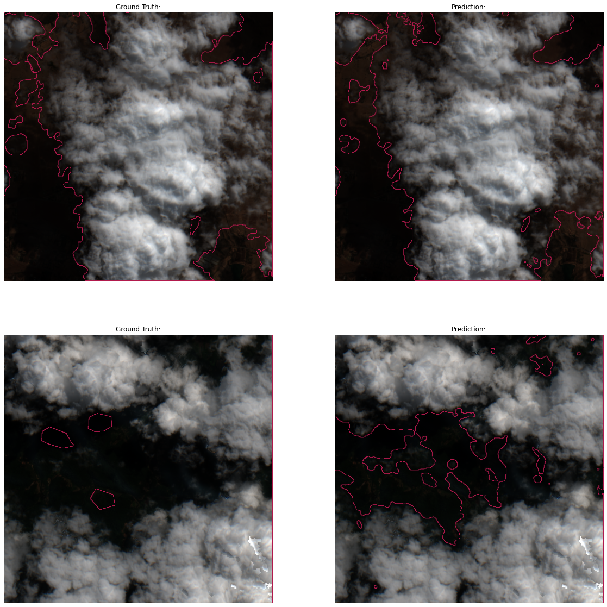
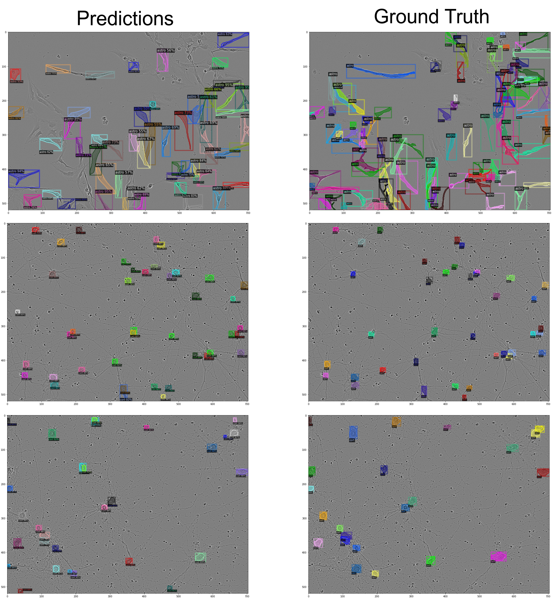
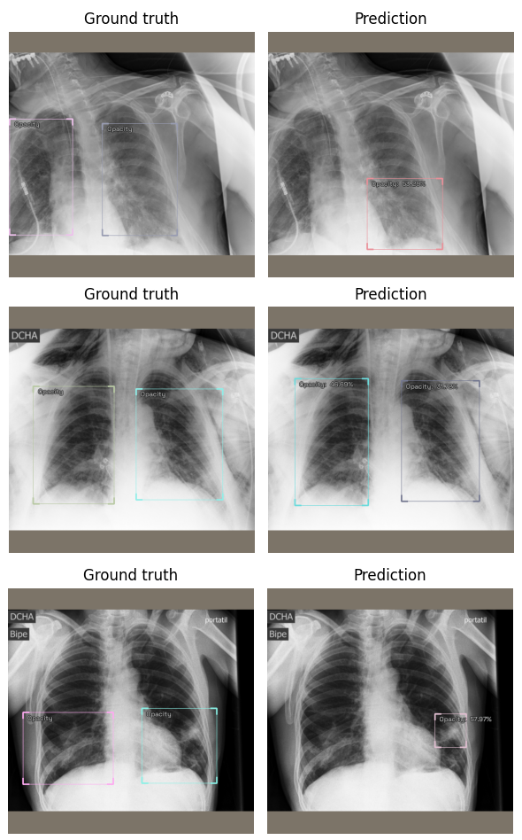
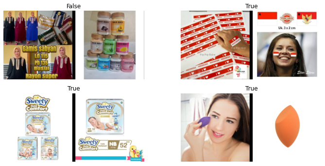
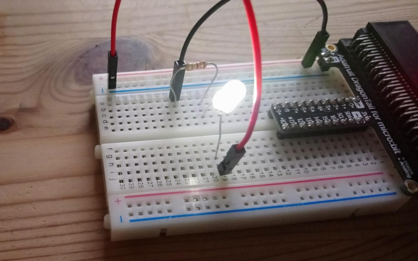
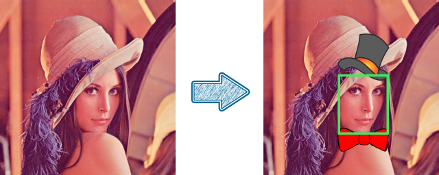
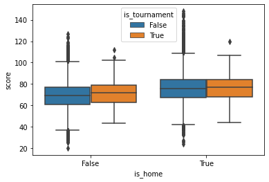
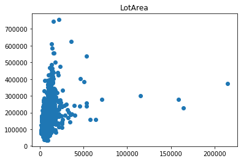
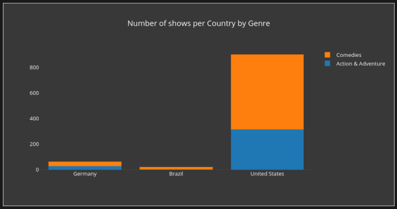
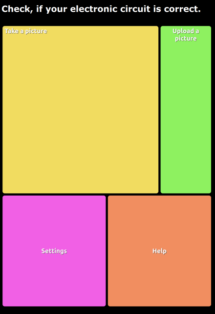

# Computer Vision
## [On Cloud N](https://github.com/Ben-Karr/OnCloudN)
_Semantic Segmentation | Deep Learning | UNet | fastai | DrivenData_

_Segment Satelite data into Cloud and No Cloud._
This Challenge was hosted on DrivenData and the goal is to segment clouds in Sentenial-2 Satelite data. Besides visual image data, the Sentenial-2 dataset also offers different non-visual bands, in particular infrared. This solution uses geometric augmentations on all four channels and “visual” augmentations on the rgb-channels only. The model is a simple U-Net that is pretrained on 440x440 random crops and fine tuned on the whole image in the original chip resolution (512x512). 

## [Sartorius Cell Segmentation](https://github.com/Ben-Karr/SartoriusCellSegmentation)
_Instance Segmentation | Deep Learning | Mask-RCNN | Python | kaggle | Detectron2 | fastai_

_Segment individual cells in cancer cell lines._
I use my own approach of switching between classification and semantic segmentation with a simple U-Net (separating individual cells in postprocessing) as well as the direct use of instance segmentation with Detectron2. Of course the (ResNet32/50) U-Net models can not keep up with the Mask-RCNN Detectron uses, but it still gained about 10% Map IoU when using this approach.

## [SIIM-FISABIO-RSNA](https://github.com/Ben-Karr/SIIM-FISABIO-RSNA)
_Object Detection| Deep Learning | CNNs | Data Preparation | Python | kaggle | fastai | icevision | YOLOv5 | pandas_

_Identify and localize COVID-19 abnormalities on chest radiographs._ In this project I prepared a medical image dataset and the related dataframe to be used in a Neural Net that predicts an arbitrary number of labeled bounding boxes. These boxes are designed to assist doctors in identifying COVID-19 infections by suggesting an area of interest and a classification of them. The backbone of this project is a RetinaNet, that makes use of _Anchor boxes_ and _Focal Loss_ and can be used with different encoders like (X)Resnets or EfficientNets.

## [Shopee Price Match](https://github.com/Ben-Karr/Shopee-PriceMatch)
_Image Recognition | Siamese Neural Net | Deep Learning | CNNs | kaggle | fastai | torch | pandas_

_Decide whether two images describe the same item or not._
This problem is often encountered in online retail: if you can _automatically_ decide whether an image of a product your competitor offers is the same as yours, you can adjust the price of yours and gain an edge. The advantage of the SiameseImage class is, that for every epoch, every image gets paired with a different image (instead of pairing the image once for all training) to augment the dataset and prevent overfitting. In this project I refined the fastai SiameseImage class and DataLoader method, to make use of a given dataframe that contains the items labels and speed up the dataloading process. 

## [RoboML](https://github.com/Ben-Karr/RoboML)
_Image Classification | Data Collection/Preparation | Deep Learning | CNNs | fastai | pandas | ipywidgets | matplotlib_

I collected photos of electronic circuits, that were either fully functioning or broken. I cropped, resized and labeled the images with a lot of additional information to make it easy to train a CNN while accounting for different situations, that would occour in "reality". This helped to understand in which situation the classifier predicts reliably and to adapt the data collection process. 

## [Zazzup Webcam](https://github.com/Ben-Karr/zazzup-webcam-opencv)
_C++ | OpenCV | Object Detection | Cascade Classifier_

_Add a hat and a bowtie to a face in a webcam stream._
I used `C++` and OpenCV (in particular a pretrained Haar Cascade Classifier) to dynamically find the bounding box around a face in a video. I then add pictures of a hat and a bowtie to the upper/lower edge of that box.

# Tabular Data

## [Basketball Scores](https://github.com/Ben-Karr/BasketballScores)
_Data Cleansing/Preparation/Visualization | Feature Engineering | Neural Nets | keras | pandas | XGBoost | Regex | scipy_

_Predict the scores of NCAA basketball games._
This dataset consisted of game results from the last 5 years in NCAA basketball. Since it was sourced by scraping the web, I needed to do a lot of cleaning and preparation of the source and engineered some useful features to train a Neural Net with keras. I also compared it to the results of fastai and XGBoost. 

## [House Pricing](https://github.com/Ben-Karr/HousePricing)
_Data Preprocessing/Visualization | Regression | Neural Nets | Gradient Boosting | Ensemble | kaggle | pandas | fastai | XGBoost | sklearn_

_Predict the housing prices in a kaggle competition._  This dataset consists of 79 features about sold houses but came with a lot of missing values which had to be filled manually and apropriately. I learned a Neural Net and a Gradient Booster to predict the house prices and ensembled both learners to decrease the error value.

## [Titanic](https://github.com/Ben-Karr/Titanic/)
_Data Preprocessing | Feature Engineering | Classification | Neural Nets | Hyperparameter optimization | kaggle | pandas | fastai | sklearn | XGBoost_

|LName|Pclass|Sex|SibSp|Parch|Cabin|Title|Age|Fare|target|
|:---:|:---:|:---:|:---:|:---:|:---:|:---:|:---:|:---:|:---:|
|Vovk|3|male|0|0|N|Mr|-0.5500|-0.4892|0|
|Tobin|3|male|0|0|F|Mr|-0.0827|-0.4921|0|
|Porter|1|male|0|0|C|Mr|1.2989|0.3984|0|
|Wick|1|female|0|2|C|Miss|0.1156|2.6696|1|
|Sutehall|3|male|0|0|N|Mr|-0.3281|-0.5062|0|
|Klaber|1|male|0|0|C|Mr|0.8885|-0.1138|0|

_Predict who survived the Titanic shipwreck in a kaggle competition._
This dataset contains information about all passangers of the Titanic voyage. After preprocessing and condensing some features I used fastai to train a Neural Net on that data. To find the "best" hyperparameters I ran a random search and stuck with the best performing. I also trained a Gradient Booster to compare the results.

# Visualization

## [Netflix Dash](https://github.com/Ben-Karr/NetflixDash)
_Data Visualization | Dashboard | Plotly | Dash | pandas | html_

_Show and compare which countries watch which kind of Netflix shows._ I used Plotly and Dash to build a Dashboard that lets you choose a list of countries and a list of Netflix show genres, which can be visualized in different forms.

# Misc

## [RoboApp](https://github.com/Ben-Karr/RoboApp)
_Deployment | Flask | html | CSS | heroku_

_Make the Machine Learning algorithm from RoboMl accessible by a webapp._ 
This is my attempt of building a custom webpage with Flask at the backend and html, CSS and JavaScript in the frontend. The design was made to make it as simple as possible to navigate through the page with a smartphone.
